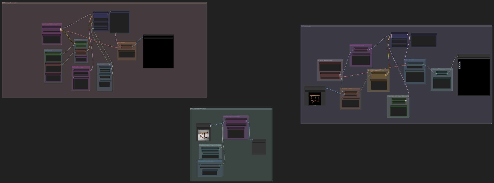

## Disclaimer
This repository is part of a university assignment and is provided for demonstration purposes only. Please do not redistribute or reuse the code without permission.

*Available only for educational and research use.*

## 3D Reconstruction Industrial Project
This repository implements a production-scale 3D reconstruction pipeline developed for university industrial project coursework. The framework integrates modern AI technologies with traditional 3D graphics tools to create an automated workflow from text descriptions to multi-view datasets for Gaussian Splatting reconstruction.

**Scope**: Complete automated 3D content generation pipeline  
**Innovation**: Integration of 5+ state-of-the-art technologies  
**Framework**: University industrial project with real-world applications  

## Blender-Based Multi-View Dataset Generator for Gaussian Splatting

A Python framework that uses Blender to automatically generate multi-view image datasets and camera matrices optimised for 3D Gaussian Splatting reconstruction.

<p align="center">
  
  
</p>
<p align="center"><em>Gaussian Splat Examples</em></p>

## Project Overview

This project automates creating high-quality training datasets for 3D Gaussian Splatting by systematically capturing multiple calibrated views of 3D objects. Rather than manually positioning cameras and rendering individual frames, this tool streamlines the entire process through an automated Blender pipeline.

Here's what the workflow does:

1. Loads and positions 3D models (`.obj` files) within Blender's coordinate system
2. Distributes cameras around the object using the Fibonacci sphere algorithm for optimal spatial coverage
3. Configures consistent lighting conditions across all viewpoints
4. Renders high-resolution images using either EEVEE-Next or Cycles engines
5. Exports camera transformation matrices alongside rendered images
6. Organises outputs in a structured directory hierarchy with comprehensive metadata

## Technical Requirements

- Blender 4.0+ (tested with Blender 4.3.2)
- Python 3.11+ (included with Blender installation)
- NumPy (required for matrix operations)
- PyTorch and Pillow (optional dependencies for extended functionality)

## Installation and Setup

### Method 1: Using Blender's Built-in Python Environment

This approach uses Blender's internal Python interpreter without requiring external dependencies.

1. Clone the repository:
```bash
git clone https://github.com/vl-pixel00/3DReconstruction-Industrial-Project.git
cd 3DReconstruction-Industrial-Project
```

2. Execute the script via Blender's command-line interface:

**With GUI (recommended for initial setup and debugging):**
```bash
# macOS
/Applications/Blender.app/Contents/MacOS/Blender --python gaussian_blender_script.py -- \
  --object_path="/path/to/model.obj" \
  --output_dir="/path/to/output"

# Windows
"C:\Program Files\Blender Foundation\Blender\blender.exe" --python gaussian_blender_script.py -- ^
  --object_path="C:\path\to\model.obj" ^
  --output_dir="C:\path\to\output"

# Linux
blender --python gaussian_blender_script.py -- \
  --object_path="/path/to/model.obj" \
  --output_dir="/path/to/output"
```

**Headless execution (suitable for batch processing):**
```bash
# Add --background flag to any of the above commands
# Example for macOS:
/Applications/Blender.app/Contents/MacOS/Blender --background --python gaussian_blender_script.py -- \
  --object_path="/path/to/model.obj" \
  --output_dir="/path/to/output"
```

### Method 2: Integration with External Python Environment (Recommended)

This method lets you use external Python libraries whilst maintaining GUI functionality, which is particularly useful for complex numerical operations and visualisation tasks.

1. Create and activate a virtual environment:
```bash
python3.11 -m venv blender-env
source blender-env/bin/activate           # macOS/Linux
blender-env\Scripts\activate              # Windows
```

2. Install required dependencies:
```bash
pip install numpy==1.26.4 pillow==10.2.0 torch==2.2.0
```

3. Configure the `start_blender.py` script with your environment's site-packages path:

```python
import sys

# Replace with the absolute path to your virtual environment's site-packages directory
sys.path.append('/Users/yourusername/.pyenv/versions/blender-env/lib/python3.11/site-packages')

# Verify successful library integration
import numpy as np
print("NumPy version inside Blender:", np.__version__)

import bpy
print("Blender is running this script successfully.")
```

> **Important**: You must update the placeholder path in `start_blender.py` with your actual virtual environment's site-packages directory path.

To find your site-packages path:
```bash
python -c "import site; print(site.getsitepackages()[0])"
```

4. Launch Blender with environment integration:

**With GUI (recommended for development):**
```bash
# macOS
/Applications/Blender.app/Contents/MacOS/Blender --python start_blender.py

# Windows
"C:\Program Files\Blender Foundation\Blender\blender.exe" --python start_blender.py

# Linux
blender --python start_blender.py
```

**Headless execution:**
```bash
# macOS
/Applications/Blender.app/Contents/MacOS/Blender --background --python start_blender.py -- --run gaussian_blender_script.py
```

5. For GUI operation, once Blender launches with external libraries loaded:
   - Navigate to the "Scripting" workspace in the top toolbar
   - Open `gaussian_blender_script.py` from the file browser
   - Configure script parameters as described in the next section
   - Execute via "Run Script" button or Alt+P keyboard shortcut

## Configuration Parameters

### Command-Line Arguments

```
--object_path               Path to the 3D model file (.obj) [required]
--output_dir                Output directory for rendered images and matrices [required]
--num_renders               Number of viewpoints to generate [default: 36]
--engine                    Rendering engine: "CYCLES" or "BLENDER_EEVEE_NEXT" [default: BLENDER_EEVEE_NEXT]
--resolution                Output image resolution in pixels [default: 2048]
--use_area_lights           Enable area lights for enhanced illumination [default: True]
--separate_matrices_dir     Store camera matrices in dedicated directory [default: True]
```

### Interactive Configuration (GUI Mode)

When running the script directly within Blender's interface, locate the `Args` class near line 771 and modify the default values:

```python
class Args:
    def __init__(self):
        self.object_path = "./models/example_model.obj"  # Update to your model path
        self.output_dir = "./output"                     # Update to desired output location
        self.num_renders = 36
        self.engine = "BLENDER_EEVEE_NEXT"
        self.resolution = 2048
        self.use_area_lights = True
        self.separate_matrices_dir = True
```

> **Note**: When executing from Blender's Script Editor, ensure these paths point to your actual model file and desired output directory.

To monitor execution progress:
- **Windows**: Window → Toggle System Console
- **macOS/Linux**: Check the terminal from which Blender was launched

## Output Structure

The script generates the following organised output:

```
output_directory/
├── 000.png, 001.png, ..., 035.png        # Multi-view rendered images
├── matrices/                             # Camera transformation matrices
│   ├── 000.npy, 001.npy, ..., 035.npy
├── cameras.json                          # Consolidated camera parameters
└── README.txt                            # Output documentation
```

## Key Features

- **Smart camera distribution**: Fibonacci sphere algorithm ensures uniform spatial sampling around the object
- **Consistent lighting setup**: Automated lighting configuration with enhanced intensity (4× for sun lights, 2× for area lights)
- **Multiple rendering engines**: Support for both Cycles (high quality) and EEVEE-Next (performance optimised)
- **Automatic GPU utilisation**: Automatically detects your graphics card (Metal on Mac, CUDA on PC, or falls back to CPU)
- **Standardised matrix export**: Camera matrices exported in NumPy format with consistent coordinate transformations
- **Clean output management**: Prevents generation of extraneous directories through compositor deactivation

## Visual Workflow Overview

### Blender Multi-View Dataset Generation Pipeline

```
┌─────────────────┐     ┌──────────────────┐     ┌──────────────────┐
│ Virtual         │     │ Blender          │     │ Script           │
│ Environment     │────>│ Launch with      │────>│ Execution with   │
│ Configuration   │     │ Library Injection│     │ Parameters       │
└─────────────────┘     └──────────────────┘     └──────────────────┘
                               │                          │
                               │                          ▼
┌─────────────────┐     ┌──────┴──────────────────┐ ┌──────────────────┐
│ Multi-View      │     │ 3D Model Loading &      │ │ Camera           │
│ Dataset +       │<────│ Fibonacci Sphere        │<│ Positioning &    │
│ Camera Matrices │     │ Camera Distribution     │ │ Rendering        │
└─────────────────┘     └─────────────────────────┘ └──────────────────┘
```

## Troubleshooting

### Environment Integration Issues

**Library import failures:**

1. Check the virtual environment path in `start_blender.py`:
   ```python
   # Find your system's correct path
   python -c "import site; print(site.getsitepackages()[0])"
   
   # Update the script accordingly
   sys.path.append('/absolute/path/to/site-packages')
   ```

2. Confirm package installation within the virtual environment:
   ```bash
   source blender-env/bin/activate  # macOS/Linux
   pip list | grep numpy
   pip list | grep torch
   ```

3. Ensure Python version compatibility:
   ```bash
   python --version
   blender --python-expr "import sys; print(sys.version)"
   ```

### Blender-Specific Issues

**Render setting attribute errors:**
Different Blender versions may have varying attribute structures. The script includes version compatibility checks:

```python
if hasattr(scene.eevee, "gi_diffuse_bounces"):
    scene.eevee.gi_diffuse_bounces = 3
```

**Unwanted directory generation:**
Ensure compositor deactivation before rendering:

```python
bpy.context.scene.use_nodes = False
```

**GPU rendering failures:**
- **macOS**: Check Metal configuration in Blender Preferences → System → GPU Backend
- **Windows/Linux**: Ensure GPU driver compatibility with CUDA or OptiX
- The script automatically falls back to CPU rendering if GPU acceleration isn't available

## ComfyUI Integration for Text-to-3D Generation

This repository includes a ComfyUI workflow for generating complete 3D models from text descriptions, integrating SDXL, SAM, and Hunyuan 3D 2.0 technologies to create production-ready 3D assets.

<p align="center">
  
</p>
<p align="center"><em>Example ComfyUI workflow configuration for text-to-3D generation</em></p>

### ComfyUI Workflow Pipeline

```
┌─────────────────┐     ┌──────────────────┐     ┌──────────────────┐
│ Text Prompt     │     │ SDXL Image       │     │ SAM Background   │
│ Input           │────>│ Generation       │────>│ Removal          │
│ "Red Chair"     │     │ Module           │     │ Module           │
└─────────────────┘     └──────────────────┘     └──────────────────┘
                                │                          │
                                │                          ▼
┌─────────────────┐     ┌───────┴──────────────────┐ ┌──────────────────┐
│ Complete 3D     │     │ Hunyuan 3D 2.0           | |Segmented         |
│ Model (.obj,    │<────│ Multi-View to 3D         │<│ Subject Image    │
│ .ply, textures) │     │ Reconstruction           │ │ with Alpha       │
└─────────────────┘     └──────────────────────────┘ └──────────────────┘
```

### ComfyUI Setup

1. Install ComfyUI:
```bash
git clone https://github.com/comfyanonymous/ComfyUI.git
cd ComfyUI
python -m venv venv
source venv/bin/activate  # Windows: venv\Scripts\activate
pip install torch torchvision torchaudio --index-url https://download.pytorch.org/whl/cu121
pip install -r requirements.txt
```

2. Install ComfyUI Manager:
```bash
cd custom_nodes
git clone https://github.com/ltdrdata/ComfyUI-Manager.git
cd ..
```

3. Launch ComfyUI:
```bash
python main.py
```

4. Access the web interface at http://localhost:8188

5. Install required custom nodes via the Manager:
   - ComfyUI Segment Anything
   - ComfyUI-Hunyuan-3D
   - ComfyUI-Advanced-ControlNet

### How to Use the Workflow

1. Launch ComfyUI by running `python main.py` from the ComfyUI directory
2. Access the web interface at http://localhost:8188
3. Import the workflow:
   - Click the "Load" button in the top menu
   - Navigate to the repository directory and select `Image_to_3D_ComfyUI.json`
4. Configure the workflow parameters:
   - Adjust text prompts to specify your desired 3D objects
   - Modify segmentation parameters if needed
   - Set quality and resolution parameters for 3D generation
   - Specify the output directory for generated 3D models
5. Execute the workflow by clicking "Queue Prompt"
6. You'll get:
   - High-quality base images from text prompts
   - Segmented subject images with transparent backgrounds
   - Complete 3D models with geometry and textures

### How the Workflows Connect

The 3D models generated by this ComfyUI workflow can be used as input objects for the main Blender-based multi-view dataset generation pipeline, creating a complete text-to-dataset workflow.

<p align="center">
  <table>
    <tr>
      <td width="50%" style="vertical-align: top;">
        
        <br>
        
      </td>
      <td width="50%">
        
      </td>
    </tr>
    <tr>
      <td align="center"><b>Input Configuration</b></td>
      <td align="center"><b>Generated 3D Output</b></td>
    </tr>
  </table>
</p>
<p align="center"><em>Example workflow execution showing input parameters and resulting 3D model</em></p>

### Using AI to Improve Results

The generation parameters shown in the example above were refined using a Large Language Model (LLM) to optimise the quality and characteristics of the resulting 3D model. This shows how LLMs can play a valuable role in the 3D content creation workflow by:

- **Parameter optimisation**: Analysing input requirements and suggesting optimal generation settings
- **Quality enhancement**: Recommending adjustments to improve model geometry and texture quality  
- **Workflow automation**: Providing intelligent defaults based on object type and desired output characteristics
- **Troubleshooting assistance**: Diagnosing generation issues and suggesting corrective parameters

This integration of AI-assisted parameter tuning significantly improves the efficiency and quality of the text-to-3D generation process, making it more accessible to users without extensive technical expertise in 3D modelling parameters.

### Things to Keep in Mind

- **Memory optimisation**: Reduce resolution parameters if you encounter VRAM limitations
- **Initial setup time**: First execution may require downloading model weights (several GB)
- **3D model quality**: Complex objects may require parameter adjustment for optimal results
- **Output formats**: Generated models are compatible with standard 3D software and game engines

## Repository Structure

- `examples/` – Sample outputs demonstrating expected results
- `start_blender.py` – Environment integration script for external Python libraries
- `gaussian_blender_script.py` – Main rendering and matrix export script
- `Image_to_3D_ComfyUI.json` – ComfyUI workflow configuration for text-to-3D generation
- `requirements.txt` – Python dependency specifications
- `README.md` – Comprehensive project documentation

## References and Further Reading

- [3D Gaussian Splatting for Real-Time Radiance Field Rendering](https://repo-sam.inria.fr/fungraph/3d-gaussian-splatting/)
- [Blender Python API Documentation](https://docs.blender.org/api/current/index.html)
- [Objaverse-XL Rendering Implementation](https://github.com/allenai/objaverse-xl/tree/main/scripts/rendering)
- [ComfyUI Official Repository](https://github.com/comfyanonymous/ComfyUI)
- [Segment Anything Model](https://arxiv.org/abs/2304.02643)
- [Stable Diffusion XL](https://arxiv.org/abs/2307.01952)
- [Hunyuan 3D Generation Framework](https://github.com/Tencent-Hunyuan/Hunyuan3D-2)

---

*This project was developed as part of computer graphics coursework, demonstrating practical applications of 3D reconstruction and automated dataset generation techniques.*